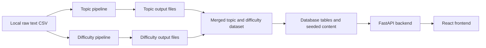

# Personalized Recommender for HRA

This repository contains the production application source code and the archived research pipeline scripts used to build the final reading recommendation approach for the Human Reading Assessment (HRA) thesis project.

The codebase is split into two clear layers:

- `backend/` and `frontend/` contain the live application.
- `research/` contains the thesis-era topic and difficulty pipeline scripts, experimental scripts, and archived recommender logic.

The important distinction is that the research pipelines are not executed by the production API at request time. They were used during the thesis work to produce topic and difficulty labels that inform the system design and the database content, while the live app serves recommendations from backend tables and runtime scoring logic.

> **Data availability notice:** The full `data/` folder, raw CSV files, generated CSV/JSON outputs, checkpoints, and dataset artifacts are not published publicly in this repository. They are kept private because they contain project-specific research data, derived outputs, or local development artifacts. The repository is intended to publish the application code, pipeline scripts, and documentation needed to understand the system and reproduce the workflow with appropriate local data.

## What This Repository Does

At a high level, the project has five major parts:

1. A topic pipeline that assigns broad topics to each reading text.
2. A difficulty pipeline that estimates reading difficulty for each text.
3. A recommender engine that combines topic fit and difficulty fit.
4. A FastAPI backend that manages sessions, recommendations, reading events, and feedback.
5. A React frontend that runs the student flow from passcode to reading completion.

## Repository Layout

- `backend/`: FastAPI app, SQLAlchemy models, runtime recommendation logic, migrations, and backend Docker image.
- `frontend/`: React and Vite application for the student-facing interface.
- `research/`: archived research pipeline scripts, notebooks, and recommender experiments.
- `docker-compose.yml`: local container orchestration for backend, frontend, and nginx.
- `nginx.conf`: reverse proxy and static asset routing.

Dataset folders and generated research outputs may be referenced by the scripts, but they are not part of the public repository.

## System Overview

The research side and product side connect conceptually like this:



In the current repository state, the production backend reads from the database, not directly from the research CSV or JSON outputs. The research outputs are treated as private/local artifacts and are not published publicly with the repository.

## Topic Pipeline

The main archived topic workflow lives in [research/recommender-experiments/topic_groq/topic_llama3.3_hitl.py](research/recommender-experiments/topic_groq/topic_llama3.3_hitl.py).

Its job is to classify Norwegian-language children's reading texts into broad topics and subtopics using Groq-hosted LLM calls with checkpointing and human-in-the-loop review.

Core local outputs include:

- `extracted_topics.json`: per-text extracted topics.
- `taxonomy_draft.json`: model-proposed broad-topic taxonomy.
- `taxonomy_final.json`: curated taxonomy used for assignment.
- `assignments.json`: text-to-topic assignment results.
- `results.csv`: merged topic output used downstream.

These generated CSV and JSON files are not published publicly. They are listed here to document the workflow and expected local outputs.

Conceptually, the topic pipeline does four things:

1. Preprocesses the corpus text.
2. Extracts candidate topics per text.
3. Builds or refines a broad-topic taxonomy.
4. Assigns each text to one or more broad topics.

This topic labeling work is central to the recommender because the production engine uses broad-topic overlap as the first ranking signal, especially in cold start rounds.

## Difficulty Pipeline

The retained difficulty workflow now lives under [research/recommender-experiments/difficulty_lix_v2](research/recommender-experiments/difficulty_lix_v2).

This folder is the consolidated archive for difficulty scoring. It contains both the upstream anchor preparation scripts and the downstream pairwise scoring scripts.

### Stage 1: Build difficulty candidates

[research/recommender-experiments/difficulty_lix_v2/anchor_candidates_v2.py](research/recommender-experiments/difficulty_lix_v2/anchor_candidates_v2.py) computes a hybrid difficulty proxy from:

- LIX readability features
- lexical diversity
- rare-word ratio
- subordination cues
- punctuation complexity

It produces candidate anchor texts and the full scored corpus as local outputs, including:

- `all_texts_lix_scores_v2.csv`
- `anchor_candidates_shortlist_v2.csv`

### Stage 2: Select anchor texts

[research/recommender-experiments/difficulty_lix_v2/anchor_selector_llm.py](research/recommender-experiments/difficulty_lix_v2/anchor_selector_llm.py) evaluates shortlisted candidates and selects one anchor per difficulty band.

Important local outputs:

- `anchor_candidates_evaluated_v2.csv`
- `final_anchors_v2.csv`

### Stage 3: Anchor-based difficulty scoring

[research/recommender-experiments/difficulty_lix_v2/difficult_pipeline.py](research/recommender-experiments/difficulty_lix_v2/difficult_pipeline.py) compares each text against the selected anchors and assigns an anchor-based difficulty score.

Important local outputs:

- `difficulty_scores_v2.csv`
- `difficulty_checkpoint_v2.json`

### Stage 4: Pairwise refinement and final difficulty

[research/recommender-experiments/difficulty_lix_v2/pairwise_pipeline.py](research/recommender-experiments/difficulty_lix_v2/pairwise_pipeline.py) performs broader pairwise comparisons and combines them with anchor-based scores.

Important local outputs:

- `pairwise_results_full.csv`
- `pairwise_scores.csv`
- `final_difficulty_scores.csv`
- `validation_metrics.json`

### Stage 5: Merge topic and difficulty outputs

[research/recommender-experiments/merged/merge_topic_difficulty.py](research/recommender-experiments/merged/merge_topic_difficulty.py) joins topic assignments with the final difficulty outputs into:

- `results_with_topic_difficulty.csv`

That merged file represents the final research dataset shape: text metadata plus topic assignments plus reading difficulty. It is a private/local generated artifact and is not published publicly in this repository.

## Recommender Engine

The production recommender logic lives in [backend/app/recommender_engine.py](backend/app/recommender_engine.py).

The key runtime components are:

- `LevelEstimator`: estimates student reading level from perceived difficulty feedback.
- `ScoringEngine`: scores candidate texts by topic overlap and difficulty fit.
- `SlateBuilder`: selects the top items for the next recommendation slate.
- `SessionManager`: manages round progression, seen texts, and session state.

### Ranking logic

The live engine combines two signals:

1. Topic relevance.
2. Difficulty fit.

The weighting changes by round through `_get_weights(...)` in [backend/app/recommender_engine.py](backend/app/recommender_engine.py#L22):

- Round 1: topic only.
- Round 2: topic-dominant mix.
- Round 3 and later: balanced topic and difficulty weighting.

This makes the recommender conservative at the start, then more personalized once the system has observed actual student responses.

## Backend

The production API lives in [backend/app/main.py](backend/app/main.py). It configures CORS, mounts static images, creates tables, and includes the session and recommendation routers.

### Main backend responsibilities

- create and validate student sessions
- enforce passcode and consent flow
- return available broad topics for interest selection
- serve recommendation slates
- record reading feedback and comprehension results
- expose text details and questions
- collect interaction events and session feedback

### Main API surfaces

Session endpoints are in [backend/app/api/sessions.py](backend/app/api/sessions.py):

- `/sessions/status`
- `/sessions/authorize`
- `/sessions/validate`
- `/sessions/start`
- `/sessions/end`

Recommendation endpoints are in [backend/app/api/router.py](backend/app/api/router.py):

- `/session/topics`
- `/session/interests`
- `/session/recommendations`
- `/session/refresh`
- `/session/reading`
- `/session/summary`
- `/session/text/{text_id}`
- `/session/text/{text_id}/questions`
- `/session/events`
- `/session/feedback/texts`

### Runtime data source

The backend currently loads recommendation candidates from database tables, not from the archived research CSVs. The query path is in [backend/app/service.py](backend/app/service.py#L248), where `load_texts(...)` joins:

- `texts`
- `text_difficulty`
- `text_topic_assignments`
- `broad_topics`
- `text_images`

That means the production system depends on the database being populated with the finalized topic and difficulty information, but it does not run the thesis pipelines on demand.

## Frontend

The student-facing application lives in `frontend/` and uses React with Vite.

The main route flow is defined in [frontend/src/routes.tsx](frontend/src/routes.tsx):

- `/`: passcode screen
- `/consent`: consent step
- `/login`: login step
- `/interests`: topic selection
- `/dashboard`: recommendation slate
- `/reading/:id`: reading view for a selected text
- `/completion`: completion page
- `/session-feedback`: end-of-session feedback

The frontend is responsible for:

- moving the student through the session flow
- calling the backend session and recommendation endpoints
- displaying recommendation slates and reading content
- collecting perceived difficulty, interest, comprehension, and final feedback

Development commands come from [frontend/package.json](frontend/package.json):

- `npm.cmd install`
- `npm.cmd run dev`
- `npm.cmd run build`

On Windows, use `npm.cmd` if PowerShell blocks `npm` because of execution policy.

## Local Development

### Run with Docker Compose

The top-level [docker-compose.yml](docker-compose.yml) starts:

- `backend`
- `frontend`
- `nginx`

Typical start command:

```powershell
docker compose up --build
```

With the current configuration:

- backend is exposed internally on port `8000`
- frontend is exposed internally on port `3001`
- nginx publishes `8001`, `80`, and `443`

### Run backend locally

From `backend/`:

```powershell
.\.venv\Scripts\python.exe -m uvicorn app.main:app --reload
```

Core backend dependencies are listed in [backend/requirements.txt](backend/requirements.txt) and include FastAPI, SQLAlchemy, pandas, numpy, scipy, psycopg2-binary, and uvicorn.

### Run frontend locally

From `frontend/`:

```powershell
npm.cmd install
npm.cmd run dev
```

## Data and Assets

During development, the project used the following local data folders:

- `data/raw`: original CSV exports and source datasets.
- `data/seed`: seeded structured outputs used to populate the database.
- `data/images`: reading images and thumbnails.

These folders are not published publicly in this repository. The raw CSV files, generated CSV/JSON outputs, checkpoints, merged datasets, and image assets are kept private because they contain project-specific research data and derived artifacts.

The backend can mount an images directory and expose it under `/images` when available. For public use or reproduction, equivalent local data must be supplied separately before running the full data preparation or seeding workflow.

## Research vs Production

Use this rule when navigating the repo:

- If you are debugging the app a student uses, stay in `backend/` and `frontend/`.
- If you are tracing how topic or difficulty labels were produced, stay in `research/`.

This keeps the runtime surface small while preserving the research workflow in the same repository structure.
